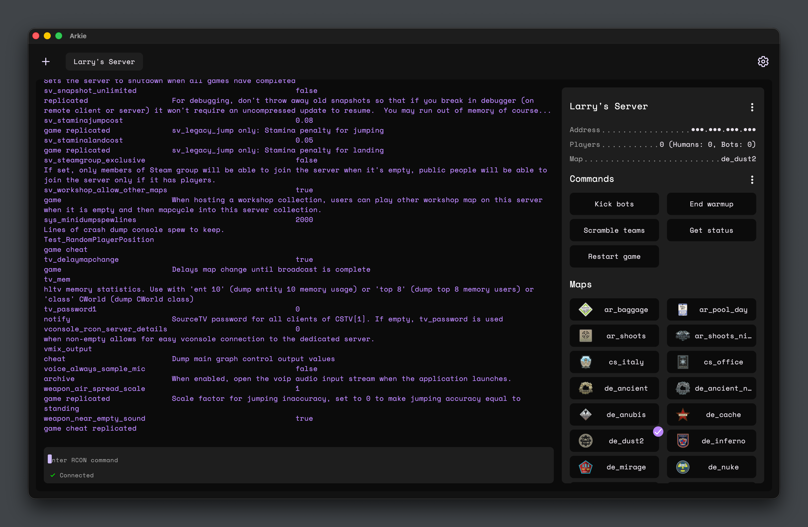

# CS2 RCON



CS2 RCON is a Melos-managed Dart/Flutter monorepo for experimenting with Counter-Strike 2 (CS2) Remote Console workflows. It contains a pure Dart client for the Source RCON protocol, a terminal experience built on top of that client, and a Flutter desktop UI that wraps the same building blocks.

## Repository layout

| Path              | Component                                                                                             |
| ----------------- | ----------------------------------------------------------------------------------------------------- |
| `packages/client` | `cs2_rcon_client`, a reusable RCON socket + connection abstraction built on `dart:io` and `oxidized`. |
| `apps/cli`        | `cs2_rcon_cli`, the `rcon connect` command that lets you type commands directly from a terminal.      |
| `apps/front_end`  | `cs2_rcon_front_end`, a Flutter desktop UI for saving servers and chatting with them over RCON.       |

## Architecture at a glance

```
                          +---------------------------+
                          | Flutter desktop UI        |
                          | apps/front_end            |
                          +-------------+-------------+
                                        |
                                        | depends on
                                        v
+----------------+     uses      +-----------------------+     TCP (RCON)     +------------------------+
| CLI (apps/cli, | ------------> | Dart RCON client      | -----------------> | Counter-Strike 2       |
| rcon cmd)      |               | packages/client       |                    | server (RCON endpoint) |
+----------------+               +-----------------------+                    +------------------------+
                                        ^
                                        |
                                        | persists saved servers via
                                        |
                             +------------------------------+
                             | RxSharedPreferences storage  |
                             | (local app preferences)      |
                             +------------------------------+
```

## Getting started

1. Install Flutter 3.24+ (which ships with Dart ≥3.8.1). Desktop targets must be enabled for the platforms you want to run (`flutter config --enable-<platform>-desktop`).
2. Install Melos once: `dart pub global activate melos`.
3. Bootstrap the workspace from the repo root:

```bash
melos bootstrap
```

This runs `flutter pub get`/`dart pub get` for every package and wires up path dependencies.

### Common Melos scripts

All scripts are defined in [`melos.yaml`](melos.yaml):

| Command                                                      | Purpose                                                                                 |
| ------------------------------------------------------------ | --------------------------------------------------------------------------------------- |
| `melos run format:flutter`                                   | Format every Flutter project.                                                           |
| `melos run format:dart`                                      | Format Dart-only packages.                                                              |
| `melos run analyze:flutter:ci` / `melos run analyze:dart:ci` | Static analysis with warnings promoted to errors.                                       |
| `melos run test:flutter:ci` / `melos run test:dart:ci`       | Run the Flutter/Dart test suites when a `test/` folder exists.                          |
| `melos run codegen`                                          | Runs `build_runner` anywhere it is available (used by the front end for model mapping). |

## Component documentation

Each package/app ships with its own README that dives into usage details:

- [`apps/front_end`](apps/front_end/README.md) – Flutter desktop UI, server list management, and realtime command view.
- [`packages/client`](packages/client/README.md) – Reusable RCON client library (sockets, packets, logging).
- [`apps/cli`](apps/cli/README.md) – The terminal command (`rcon connect`) built on top of the client.

## Releases and support

This repository contains the public source code, documentation, and pull request checks. Release signing, App Store deployment, release tags, and binary asset publishing are handled outside of the public repository so signing credentials and release automation stay private.

Use the GitHub issue tracker for bug reports and feature requests. Please do not include real RCON passwords, private server addresses, or other secrets in issues, discussions, logs, or screenshots.

## Contributing

- Prefer running commands through Melos so that every package stays consistent.
- When editing `apps/front_end/features/servers` models, re-run `melos run codegen` to regenerate the `dart_mappable` files.
- The repo currently targets local networks; make sure the CS2 server’s RCON port is reachable from your machine (default `27015`).
- See [`CONTRIBUTING.md`](CONTRIBUTING.md) for the full local development and pull request workflow.
